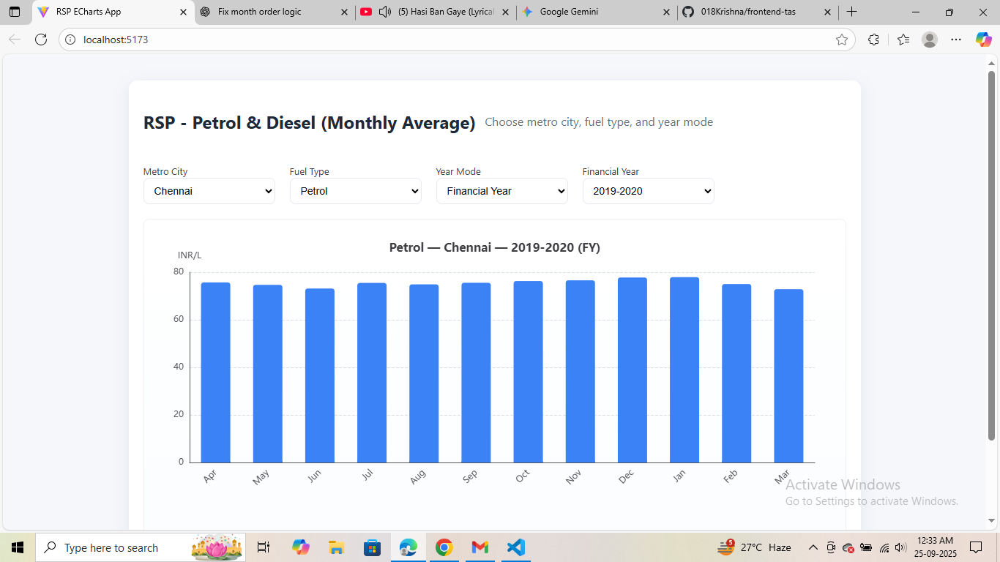

🚗 Fuel RSP Dashboard (Petrol & Diesel Prices)

Hey there! 👋 Welcome to the Fuel RSP Dashboard, a React app that helps you visualize monthly average petrol and diesel prices across metro cities in India.

With this dashboard, you can toggle between Financial Year (FY) and Calendar Year (CY), filter by city, fuel type, and year, and see the data come alive in interactive charts powered by ECharts.

## screenshot




## Features

- Load and parse RSP CSV data (Petrol & Diesel).

 - Automatically compute monthly averages for your selected city, fuel, and year.

 - Switch between Financial Year (Apr–Mar) and Calendar Year (Jan–Dec) views.

 - Beautiful interactive bar charts to visualize trends.

- Handles tricky CSVs with quoted commas, currency symbols, and commas in numbers.

- Responsive UI for quick selection of city, fuel type, year, and year mode.

- Missing values? No worries—they’re treated as 0.
---

## Technologies

- React – Frontend UI framework  
- TypeScript – Type safety for React components  
- ApacheECharts – Charting library for interactive bar charts  
- Fetch API – For loading CSV data  
-  Tailwind CSS / Inline Styles – Basic styling for layout  

---

## Tools & Libraries

- Node.js (v16+)  
- npm or yarn package manager  
- React (v18+)  
- ECharts (`echarts` npm package)  
- TypeScript (`tsconfig.json` for type definitions)  


## Getting Started

### Prerequisites

- Node.js installed ([Download Node.js](https://nodejs.org/))  
- npm or yarn package manager  

### Installation

1. Clone the repository:

```bash
git clone https://github.com/your-username/fuel-rsp-dashboard.git
cd fuel-rsp-dashboard


yarn add install

yarn dev


